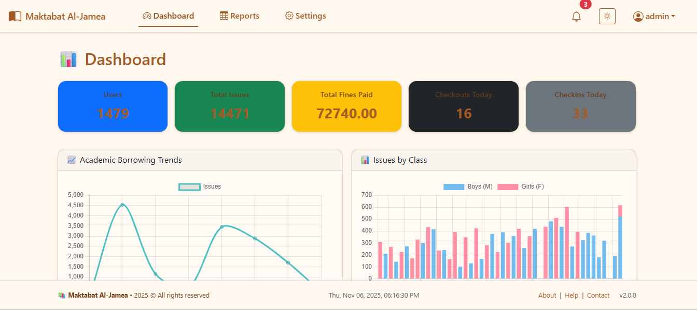
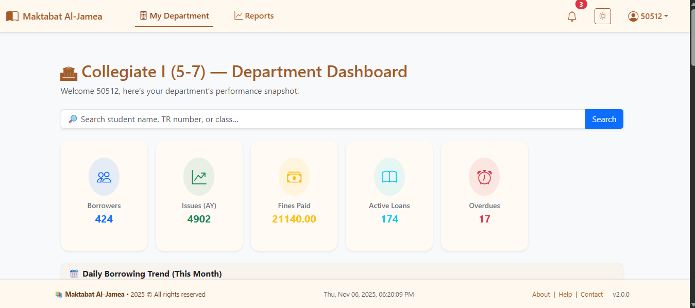
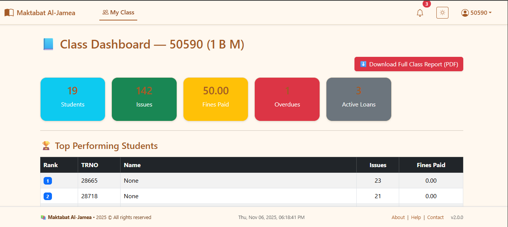
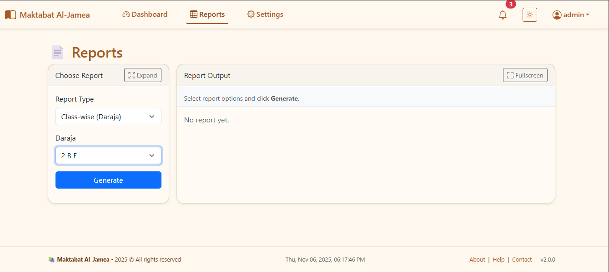
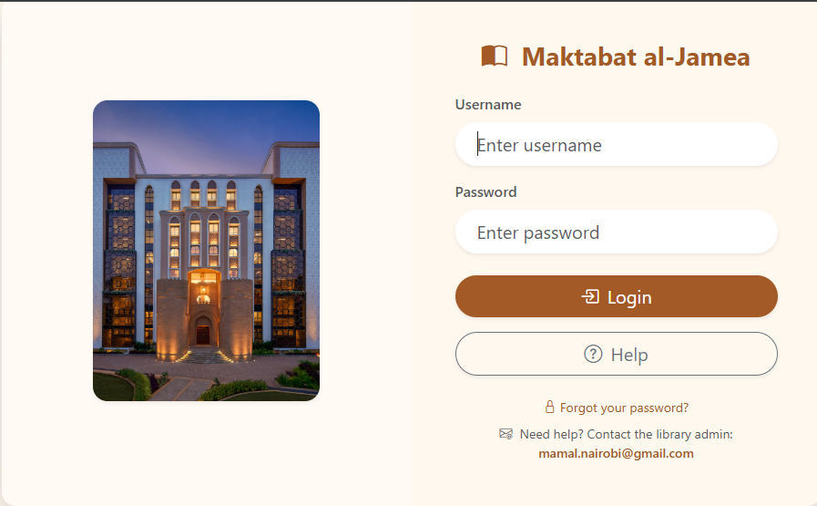

---
# 📚 Maktabat al-Jamea Library Dashboard
---

A professional, role-based dashboard built with Flask and seamlessly integrated with Koha ILS. It provides real-time analytics, automated scheduled reports, and secure dashboards for administrators, heads of departments (HODs), and class teachers—enabling data-driven decisions and streamlined library management.

---

## ✨ Key Features

### 🔐 Role-Based Authentication

* Secure login for:

  * **Administrators**
  * **Heads of Departments (HODs)**
  * **Class Teachers**
* Credentials configured via `.env`
* Password reset via email verification

### 📊 Interactive Dashboards

#### 🧭 Admin Dashboard

* Global KPIs: patrons, issues, fines, and most borrowed titles
* Monthly/yearly borrowing trends
* Manage users, mappings, and email schedules

#### 👩‍🏫 Teacher Dashboard

* Class-specific statistics
* Student borrowing histories
* Download class performance reports

#### 🏛️ HOD Dashboard

* Department-wide analytics
* Identify top-performing classes and popular books
* Generate department summary reports

### 📑 Reports & Analytics

* Class, department, and student-level reports
* Borrower photos and detailed history
* Export to **PDF**, **Excel**, or **ODS**

### 📧 Automated Email Reports

* Monthly class reports → sent to **teachers**
* Department summaries → sent to **HODs**
* Configurable scheduler (**daily**, **weekly**, or **monthly**)
* Professional, responsive HTML email templates

### ⚙️ Admin Controls

* Manage **student–class–teacher mappings**
* Assign and update **department heads**
* Configure **database**, **email**, and **scheduler**
* Monitor all **background jobs and logs**

---

## 🖼️ Dashboard Preview

| Role                        | Screenshot                                                     |
| --------------------------- | -------------------------------------------------------------- |
| 🧭 **Admin Dashboard**      |      |
| 🏛️ **HOD Dashboard**       |          |
| 👩‍🏫 **Teacher Dashboard** |  |
| 🧾 **Reports View**         |            |
| 🔐 **Login Page**           |                |


---

## 🗂️ Project Structure

```
maktabat/
│── app.py                     # Flask app entry point
│── config.py                  # Environment configuration
│── db_app.py                  # Local SQLite (users, mappings, settings)
│── db_koha.py                 # Koha MySQL DB connection
│── scheduler.py               # APScheduler setup
│
│── email_utils/               # Email sending utilities
│── services/
│   ├── koha_queries.py        # SQL queries for Koha
│   ├── reporting.py           # Report generation logic
│   └── exports.py             # PDF, Excel, ODS export helpers
│
│── tasks/
│   ├── scheduler.py           # Background job control
│   └── monthly_reports.py     # Automated email reports
│
│── routes/
│   ├── admin.py               # Admin routes
│   ├── dashboard.py           # Admin dashboard routes
│   ├── hod_dashboard.py       # HOD dashboard routes
│   ├── teacher_dashboard.py   # Teacher dashboard routes
│   ├── reports.py             # Report APIs
│   ├── student.py             # Student views
│   ├── auth.py                # Authentication logic
│   └── password_reset.py      # Password reset flow
│
│── templates/
│   ├── base.html
│   ├── dashboard.html
│   ├── hod_dashboard.html
│   ├── teacher_dashboard.html
│   ├── reports.html
│   ├── student.html
│   ├── settings.html
│   ├── forgot.html
│   ├── reset.html
│   └── emails/
│       ├── class_report_email.html
│       ├── department_report_email.html
│       └── password_reset_email.html
│
│── static/
│   ├── css/style.css
│   ├── js/script.js
│   └── screenshots/            # Add dashboard preview images here
│
│── appdata.db                 # Local SQLite (auto-created)
│── appdata_init.py            # Initialize local DB
│── requirements.txt
│── .env
│── README.md
```

---

## ⚙️ Installation

### 1️⃣ Clone the Repository

```bash
git clone https://github.com/Nyakwar-Orera/Aljamea-Maktabat.git
cd Aljamea-Maktabat
```

### 2️⃣ Create a Virtual Environment

```bash
python -m venv venv
source venv/bin/activate   # Linux/Mac
venv\Scripts\activate      # Windows
```

### 3️⃣ Install Dependencies

```bash
pip install --upgrade pip setuptools wheel
pip install -r requirements.txt
```

### 4️⃣ Configure Environment Variables

Create a `.env` file in the project root:

```bash
# Flask
SECRET_KEY=super_secret_key_here

# Admin login
ADMIN_USER=admin
ADMIN_PASS=adminpass

# Email
MAIL_SERVER=smtp.gmail.com
MAIL_PORT=587
MAIL_USE_TLS=True
MAIL_USERNAME=your_email@gmail.com
MAIL_PASSWORD=your_app_password
ADMIN_EMAIL=your_email@gmail.com

# Koha DB
DB_HOST=197.211.6.51
DB_USER=library_read
DB_PASS=Library@5152
DB_NAME=koha_library

# Local DB
APP_SQLITE_PATH=./appdata.db

# Scheduler defaults
REPORT_SEND_DAY=1
REPORT_SEND_HOUR=8
REPORT_SEND_MINUTE=0

# UI
PAGE_SIZE=25
```

---

## ▶️ Running the Application

**Initialize the local database**

```bash
python appdata_init.py
```

**Start the Flask server**

```bash
flask run --host=0.0.0.0 --port=5000
```

Access the app → [http://localhost:5000](http://localhost:5000)

---

## ⏰ Scheduler & Automation

This system uses **Flask-APScheduler** for background task automation.

* Executes `send_all_reports(app)` from `tasks/monthly_reports.py`
* Fully configurable under **Admin → Settings → Email Settings**

**Supports:**

* Daily / Weekly / Monthly intervals
* Customizable execution time

---

## 📬 Email Templates

| Template                       | Recipient | Description                       |
| ------------------------------ | --------- | --------------------------------- |
| `class_report_email.html`      | Teachers  | Monthly class performance reports |
| `department_report_email.html` | HODs      | Department-level summaries        |
| `password_reset_email.html`    | All users | Password reset with secure link   |

All templates use **responsive, branded HTML layouts** compatible with Gmail and Outlook.

---

## 🔐 Roles & Permissions

| Role        | Access Scope            | Description                           |
| ----------- | ----------------------- | ------------------------------------- |
| **Admin**   | Full system control     | Manage users, schedules, and settings |
| **Teacher** | Class-level access      | View student and class reports        |
| **HOD**     | Department-level access | Analyze department data and trends    |

---

## 📌 Notes

* Store student photos in `static/photos/` using **cardnumber** or **mapped ID** filenames.
* Koha DB credentials should be **read-only** for security.
* Gmail SMTP with 2FA requires an **App Password**.

---

## 🚀 Roadmap

* ✅ REST API for third-party integration
* 📈 Enhanced visual analytics and dashboards
* ⚡ Optimized reporting for large datasets
* 🧠 Activity logs and system monitoring

---

## 🧑‍💻 Author

**Patrick (Nyakwar-Orera)**
📧 [GitHub Profile →](https://github.com/Nyakwar-Orera)

For issues or contributions:
👉 [https://github.com/Nyakwar-Orera/Aljamea-Maktabat/issues](https://github.com/Nyakwar-Orera/Aljamea-Maktabat/issues)

---

## 🏛️ License

This project is licensed under the **MIT License**.

---

